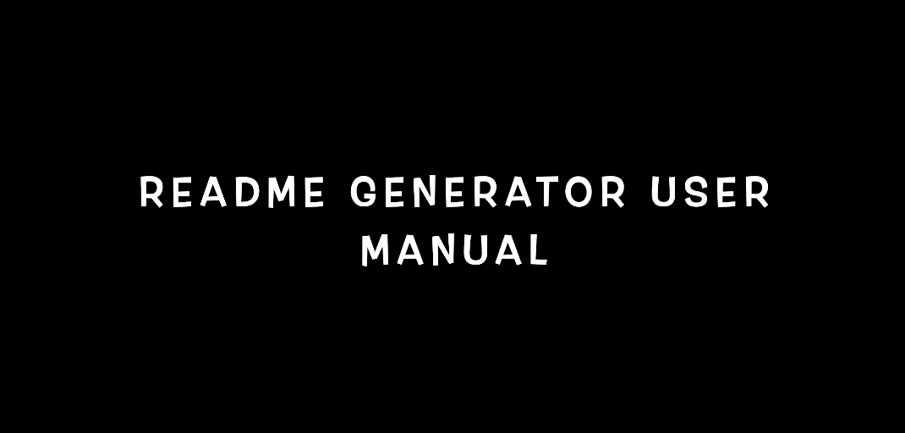

# README Generator

  ##Link to deployed application/Repository:  
  https://github.com/fanidt/Read-me-Generator

 #Table of contents  
 -[Description](##Description)  
  -[User Story](##User Story)  
 -[Badges](##Badges)  
  -[Screenshot](##Screenshot)  
 -[Installation](##Installation)  
 -[Usage](##Usage)  
 -[Support](##Support)  
  -[Roadmap](##Roadmap)  
 -[Contributions](##Contributions)  
 -[Authors](##Authors)  
 -[License](##Licence)  

  ##Description:  
  A node.js application that takes user input and provides a README.md file. The file is created in the utils directory

  ##User Story:  
  AS A developer     I WANT a README generator   SO THAT I can quickly create a professional README for a new project
  
  ##Badges:  
  
  
  ##Screenshot:  
    (https://www.youtube.com/embed/BAidZ8ia4k4)
  
  ##Installation:  
  Download the file to your computer,  Open the file in the command line,  Type npm init,   After selecting all the options,   Type npm install

  ##Usage:  
    Open the file through the command line,   Type node index,   Answer the questions,   Open utils file and your readme will be generated

  ##Support:  
  Contact us by email at: deltorofanie@gmail.com  
  Contact us at Github at: https://github.com/fanidt

  ##Roadmap:  
  Add multiple Author support,   Add multiple license support,    Add languages used section,   Add UI

  ##Contributions:  
  No contributions allowed

  ##Authors:  
  fanidt
  
  ##Licence:  
  MIT  
  License Link: https://opensource.org/licenses/MIT

##Generated with this application by Fanidt 
